# Quant Fund System — Design Document

**Owner:** aitmai
**Status:** Design complete (strategy-review fixes incorporated), pre-build
**Last updated:** 2026-07-12

---

## 1. Overview

A systematic, rules-based portfolio management system for a $1,000,000 fund, split into two sleeves:

- **90% Long Sleeve** — daily equity purchases (~$1,000/day at market open) into a single "best stock," selected via a combined **Factor (Fama-French style) + Machine Learning ranking + Statistical/Correlation filtering + Risk Parity sizing** pipeline. Positions are intended to be held 5+ years.
- **10% Volatility/Hedge Sleeve** — tactical allocation to VIX-linked instruments and S&P 500 puts, sized and timed using implied-vs-realized volatility spreads, VIX term structure, and a GARCH volatility forecast (replacing simple fixed VIX-level thresholds).

The system is built as a 6-stage pipeline (Stages 1–6, plus an independent exit-rule process for held positions), backed by a Postgres database (hosted on Supabase — see §5), run via scheduled cron jobs with full manual override capability from a GUI, and validated through a walk-forward backtest engine before any real capital is deployed.

**This is a personal quant research/portfolio-management project, not investment advice, and not a registered fund. All statistical rules described here (factor weights, thresholds, vol targets) are configurable design parameters, not guarantees of performance.**

---

## 2. Strategy Classification

This is a **systematic rules-based strategy**, not a purely statistical "quant model," until every rule is backed by an estimated/backtested parameter rather than an arbitrary heuristic. The design below intentionally converts each original heuristic (fixed VIX levels, a single "best stock" pick, flat dollar sizing) into a parameter derived from historical data and continuously re-validated via backtesting.

| Sleeve | Strategy Families Combined |
|---|---|
| 90% Long | (3B) Correlation/cointegration-aware selection filtering + (4) Factor investing + (7) Machine learning ranking + (8) Risk parity / volatility-targeted sizing |
| 10% Hedge | (5) Volatility/options-based strategy (implied-vs-realized spread, VIX term structure, GARCH forecast) |

---

## 3. Six-Stage Pipeline + Exit Rule

### Stage 1 — Universe Construction
- **Input:** Index constituent lists (S&P 500 / Russell 1000 via ETF holdings files), plus optional manually uploaded ticker lists.
- **Filters:** market cap floor, minimum average daily dollar volume, exchange listing, sufficient price history (2+ years).
- **Output:** `universe` table — the eligible ticker pool for the pipeline.
- **Cadence:** Monthly cron for index membership reconciliation (diffing against official constituent files) + event-driven check around quarterly index rebalance dates + manual GUI trigger + manual ticker list upload (same table, tagged by source).

### Stage 2 — Factor Scoring
- **Input:** `universe` + `price_history` + `fundamentals`.
- **Computes:** Momentum z-score (12-1 month), Quality z-score (ROE, margin stability, debt/equity), Value z-score (FCF yield, EV/EBITDA), Low-volatility z-score (inverse trailing 60-day realized vol).
- **Output:** Raw z-scores per ticker — **no fixed-weight composite score**. (Revised per fix #5 — factor weighting is no longer a hand-set constant; it's learned by the Stage 3 model instead.)
- **Cadence:** Weekly cron (price-based factors benefit from weekly refresh; fundamentals refresh weekly but mostly only change post-earnings) + manual GUI trigger.
- **Rule:** **Must run after Stage 1 data lands. Scores whatever data is available — does not wait for full universe backfill to complete.**

### Stage 3 — ML Ranking
- **Input:** Stage 2's **raw factor z-scores** (momentum, quality, value, low-vol — fed in as individual model features, not pre-combined) + auxiliary features (earnings revisions, sentiment/NLP score, sector, macro variables).
- **Computes:** `P(outperform)` per stock via gradient-boosted tree / logistic classifier, trained on historical factor scores + realized forward returns. The model learns the effective weighting between factors itself during each walk-forward retrain cycle, rather than relying on a static config value.
- **Output:** Re-ranked shortlist (~20–50 names), plus feature-importance output per retrain cycle (which factors the model is currently leaning on — diagnostic only, not used downstream).
- **Cadence:** Daily cron, before market open + manual GUI trigger.
- **Fix #5 rationale:** Previously, factor weights were a fixed config value requiring manual re-tuning. Folding raw z-scores directly into the ML model's feature set means factor weighting is re-estimated automatically every walk-forward retrain — one data-driven layer instead of a hand-set heuristic sitting in front of a data-driven one.

### Stage 4 — Correlation Filter (Strategy 3B)
- **Input:** Stage 3 shortlist **plus all currently held positions** (from `positions`) — **fix #2**: the filter no longer checks candidates only against each other; it also checks each candidate against every existing holding, so the shortlist can't add a name that's secretly the same bet as something already in the book.
- **Computes:**
  1. Pairwise return correlation matrix (candidates × candidates, and candidates × held positions) over a **60-trading-day lookback window** (configurable). Any pair exceeding the **exclusion threshold (default 0.85)** — the lower-ranked/newer candidate is dropped.
  2. **Sector concentration cap** (new, complements the pairwise check): reject a candidate if adding it would push that GICS sector above a configured ceiling of total NAV (default 15%). This scales better than pairwise correlation once the book holds hundreds of positions, and is easier to audit.
- **Output:** De-duplicated, correlation- and sector-filtered shortlist (~10–20 names).
- **Cadence:** Daily cron, before market open + manual GUI trigger.
- **Parameter notes:**
  - *Shorter window* (e.g., 20d) = more reactive to newly emerging correlations, noisier.
  - *Longer window* (e.g., 120–252d) = more stable/structural relationships, slower to detect regime change.
  - 60 days is the default middle-ground.
  - Performance note: even at a few hundred held positions, computing correlations against all of them daily is cheap (sub-second) — not a real scaling concern at this fund size.

### Stage 5 — Risk-Parity Position Sizing
- **Input:** Stage 4's final shortlist.
- **Computes:** `Position_size = Base_$1000 × (Target_vol / Stock_realized_vol)`. Default **target volatility = 15% annualized** (roughly in line with the S&P 500's own long-run volatility — a neutral starting point).
  - Higher target vol → larger dollar allocations, more aggressive, higher swings.
  - Lower target vol → smaller allocations across the board, smoother but more conservative.
- **Output:** Final daily dollar allocation to the top name(s).
- **Cadence:** Daily cron, before market open + manual GUI trigger.

### Exit Rule — Long Sleeve (fix #1)
Previously undefined ("hold 5+ years" was a horizon, not an exit rule). Now combines **time-based** + **valuation/re-scoring** logic, as decided:

1. **Minimum hold: 4 quarters.** No position is eligible for exit before 4 full quarters have elapsed since purchase — this protects the "5+ year" long-term thesis from being undermined by short-term noise-driven selling.
2. **After the minimum hold, run the position back through the full pipeline** (Stages 2 → 3 → 4) as if it were a new candidate being evaluated today:
   - Recompute its factor z-scores (Stage 2).
   - Recompute its `P(outperform)` via the current model (Stage 3).
   - **Exit trigger:** if the position would *not* be selected by today's pipeline (falls out of the top-ranked shortlist, or its value z-score has inverted sharply — i.e., it's become expensive relative to its own history/peers) → flag for sale.
3. This re-scoring check runs **quarterly** (aligned with the 4-quarter minimum hold, then every quarter thereafter) rather than daily — avoids overtrading on short-term score noise while still catching genuine thesis decay.
4. **Hard stop-loss override** (runs independently of the above, any time): if unrealized loss exceeds a configured threshold (default -25%) from cost basis, exit immediately regardless of quarter timing — a safety net under the periodic re-scoring logic.

**New tables:**
- **`exit_rules_config`**: rule_type (min_hold\|requalification\|stop_loss), threshold_value, lookback_period
- **`exit_signals`**: ticker, signal_date, rule_triggered, current_score, current_rank, unrealized_pnl_pct, run_id — logs *why* an exit was flagged, kept separate from the actual `trades` sell record (same signal-vs-execution separation used elsewhere in this design).

### Stage 6 — Portfolio-Level Risk Aggregation (fix #3)
New stage, runs daily after Stage 5, across **all held positions** (not just the day's new candidate):
- **Aggregate portfolio volatility**, computed from the full covariance matrix of held positions (not a simple sum of individual position vols — correlation between holdings matters here).
- **Sector/industry concentration** — % of NAV per GICS sector.
- **Aggregate portfolio beta** to the S&P 500.
- **Aggregate factor exposure** — total momentum/quality/value/low-vol tilt across the whole book, not just per-stock.
- **Feedback loop (optional, configurable):** if aggregate portfolio volatility exceeds a configured ceiling, Stage 5's daily sizing throttles down (buys less that day) until back in range — ties risk management directly into the buy decision rather than only reporting after the fact.
- **Output table:** `portfolio_risk_snapshots` (snapshot_date, portfolio_vol, portfolio_beta, sector_concentration JSON, factor_exposure JSON, top_correlated_clusters JSON).
- **Cadence:** Daily, after Stage 5 + manual GUI trigger.

### Hedge Sleeve (10%) — Volatility/Options Strategy (fix #7 — concrete mechanics)
Replaces fixed VIX-level thresholds (15/20/25) with a continuous signal combining:
  - Implied vs. realized volatility spread
  - VIX term structure (contango/backwardation)
  - GARCH(1,1) forward volatility forecast

**Concrete tradable instruments (previously left abstract — now pinned down):**
- **Volatility leg:** VIX **futures** (front-month), not spot VIX (which isn't directly tradable). Roll rule: roll to the next month's contract 5 trading days before front-month expiry. Contango/backwardation drag from the roll is explicitly modeled — logged in `vol_hedge_state` as a running cost, not ignored.
- **Options leg (SPY puts):** switched from SPX to **SPY** puts — SPX is an index, not a stock, and the chosen options-data provider's coverage is confirmed only for equities/ETFs, not indices; SPY tracks the same S&P 500 exposure and is the single most liquid options product available, so data depth is a non-issue. Fixed, backtestable convention: buy the **~30-delta put**, **30–45 days to expiration (DTE)**. Roll to a new put at **7 DTE** on the existing contract (avoids gamma/pin risk into expiration). Trade-off accepted: SPY is American-style/physically-settled vs. SPX's cash-settled European-style with Section 1256 tax treatment — a real distinction for live tax accounting, not one that changes backtested hedge mechanics materially.
- **Sizing in contracts, not raw dollars:** `contracts = floor(target_dollar_allocation / (contract_multiplier × premium))` — accepts rounding rather than assuming fractional/continuous dollar positions.
- **Theta decay tracking:** day-over-day option time decay is tracked explicitly in `vol_hedge_state` so both live P&L and backtest results reflect the real cost of holding the position, not just entry/exit price differences.

**Options data — two-tier provider approach:**
- **Live sizing (free tier, current):** `yfinance` (Yahoo Finance) provides the live SPY options chain — strike, bid/ask, volume, open interest, implied volatility — at no cost. It does not return Greeks directly, so **delta is computed in-house via Black-Scholes** (inputs: strike, underlying price, implied volatility, time-to-expiration, risk-free rate) to identify the ~30-delta put per the rule above. This is sufficient to run the hedge sleeve live, day to day, for free.
- **Historical backtesting (paid upgrade, deferred):** `yfinance` only exposes *current* chains, not historical point-in-time options data — so it cannot backtest the hedge sleeve at all. When ready to validate the hedge sleeve historically, **EODHD's US Stock Options Data API** ($29.99/month early-adopter rate, $39.99/month standard — covers 6,000 top-traded US stocks including SPY, with full Greeks pre-calculated, EOD + 1 year historical) is the natural upgrade, since EODHD is already the price-history provider elsewhere in this design — one vendor, one key, no new integration surface.
- **Practical sequencing implication:** the long sleeve can be fully backtested today with existing free-tier data; the hedge sleeve can run *live* for free today but its *backtest* is gated behind this $29.99–39.99/month spend. Until that's turned on, treat the hedge sleeve as a live-only addition layered on top of a long-sleeve-only backtest.

Sizing/timing scale continuously rather than jumping in discrete steps. Tracked in its own state table (`vol_hedge_state`, extended — see schema §6.3), refreshed daily alongside Stage 5.

---

## 4. Manual + Cron Coexistence (applies to every stage)

Every stage supports **both** a scheduled cron run and an on-demand GUI-triggered run, writing through the **same underlying service function** — never duplicated logic. Every write is tagged with `run_type ('cron' | 'manual')` and a `run_id`, so:
- History is never overwritten — each run produces a new tagged row set.
- The GUI can show "what did the model say at 6am vs. what I got when I reran at 2pm."
- Debugging any decision traces back through `run_id` to its originating job.

---

## 5. Data Ingestion Design (Backfill → Maintenance)

### Two-Phase Cron Behavior
1. **Backfill phase** — runs daily, consuming a fixed daily API budget, working through the full universe from a persisted checkpoint (`ingestion_state`), never re-fetching completed tickers.
2. **Maintenance phase** — once the full universe is backfilled, the *same* cron switches automatically (no separate code path) to only refreshing stale/incremental data, plus auto-absorbing newly added tickers (which re-enter backfill-style fetching individually).

### Separate Budgets Per Data Type
Price history and fundamentals are ingested on **independent daily budgets** (configured in `ingestion_config`), since fundamentals need far less frequent refresh (quarterly) than price history (daily) — a shared budget would let one starve the other.

### Retry Policy
Failed fetches retry automatically up to `retry_count < 3`; beyond that, they're flagged for manual review rather than silently retried forever.

### Fundamentals Provider — Confirmed Free Tier Behavior (resolved)
FMP's bulk/batch endpoints (`income-statement-bulk`, `ratios-bulk`, `key-metrics-bulk`, etc.) are **not available on the free tier** — they require Professional/Enterprise-level access. On the free plan, **every ticker's fundamentals pull is one request, with no batching workaround.** A second, separate constraint also applies: a 500 MB trailing-30-day bandwidth cap, tracked independently of the 250/day request count — `ingestion_config` should track both, since either could bind first depending on per-ticker payload size.

**Confirmed backfill timeline at 250 requests/day, one ticker per request:**
| Universe size | Days to fully backfill fundamentals |
|---|---|
| 250 tickers | 1 day |
| 500 tickers | 2 days |
| 3,000 tickers (Russell 3000-scale) | ~12 days |

This validates rather than changes the ingestion design in this section — the backfill-then-maintenance cron pattern above was already built to handle exactly this kind of slow, resumable, multi-day backfill via `ingestion_state`'s persisted checkpoint. Once backfill completes, maintenance-mode refreshes are far lighter (fundamentals change mostly on a quarterly cadence), so 250/day comfortably sustains steady-state upkeep for a universe in the thousands — the free tier is a real constraint on *initial* backfill speed only, not on ongoing operation. Upgrading to a paid FMP tier for bulk access is a "faster backfill" optimization, not a requirement.

### Data Providers
| Purpose | Provider | Free Tier (approx., verify before build) |
|---|---|---|
| Fundamentals | Financial Modeling Prep (FMP) | 250 requests/day, EOD + basic statements |
| Fundamentals (backup/cross-check) | SEC EDGAR (direct) | Free, no key, requires XBRL parsing |
| Price history | Tiingo / EODHD | Free tiers, verify current call limits |
| VIX / index history | FRED, CBOE | Free, unrestricted |
| **Options chain (live, SPY puts)** | **yfinance** | Free — current chains only, no Greeks (delta computed via in-house Black-Scholes) |
| **Options chain (historical, for hedge sleeve backtesting)** | **EODHD US Stock Options Data API** | Not free — $29.99/mo early-adopter, $39.99/mo standard; EOD + 1yr historical, full Greeks pre-calculated; deferred until hedge sleeve backtesting is prioritized |
| **Postgres hosting** | **Supabase** | 500 MB storage, 2 free projects, no hard expiry — see rationale below |

**Postgres hosting decision:** Supabase was chosen over Render's free Postgres (hard 30-day expiry, then a 14-day grace period, then permanent deletion) and evaluated against Neon (auto-suspend/resume with no manual step, similar storage cap). Supabase's free tier pauses a project after 7 days of *zero database activity* — but this system's own daily cron jobs (Stages 3–5, hedge sizing) write to the database well inside that window, so in steady-state operation the pause condition is never actually triggered; the pipeline's normal activity functions as its own keep-alive. The only real exposure window is pre-launch, before crons are scheduled — mitigated with a trivial daily ping job until the real pipeline takes over that role automatically. No credit card required; data persists indefinitely (not time-bounded) as long as usage stays under the 500 MB cap.

---

## 6. Database Schema

### 6.1 Reference / Universe
- **`universe`**: ticker, company_name, market_cap, avg_dollar_volume, exchange, sector, is_active, source (auto\|manual), added_date
- **`universe_changes`**: ticker, change_type (added\|removed), change_date, source_index, detected_by (cron\|manual), reason
- **`price_history`**: ticker, date, open, high, low, close, volume, adj_close
- **`fundamentals`**: ticker, report_date, filed_date, roe, ev_ebitda, fcf_yield, debt_equity, earnings_variance
  - `filed_date` is critical — used for point-in-time correctness in backtests (see §8.2).

### 6.2 Ingestion Control
- **`ingestion_state`**: ticker, data_type (price\|fundamentals), last_fetched_date, fetch_status (pending\|complete\|failed), last_attempt_at, retry_count, priority_rank
- **`ingestion_config`**: data_type, daily_budget, calls_per_ticker, monthly_bandwidth_cap_mb, running_bandwidth_used_mb *(bandwidth fields added — see §5, FMP's free tier caps at 500 MB trailing 30 days, tracked independently of the daily request count)*

### 6.3 Pipeline Output (Stages 2–6)
- **`factor_scores`**: ticker, score_date, momentum_z, quality_z, value_z, lowvol_z, decile_rank, run_type, run_id — *(no `composite_score` — fix #5: raw z-scores feed the ML model directly, no fixed-weight combination)*
- **`ml_rankings`**: ticker, score_date, p_outperform, model_version, feature_importance (JSON), run_type, run_id
- **`correlation_filtered_shortlist`**: ticker, score_date, correlation_flag, sector_cap_flag, excluded_due_to, final_rank, run_type, run_id — *(fix #2: adds sector_cap_flag; correlation_flag now reflects checks against held positions too, not just same-day candidates)*
- **`daily_picks`**: ticker, trade_date, position_size, target_vol, realized_vol, dollar_allocated, run_type, run_id, executed
- **`portfolio_risk_snapshots`** *(new — fix #3)*: snapshot_date, portfolio_vol, portfolio_beta, sector_concentration (JSON), factor_exposure (JSON), top_correlated_clusters (JSON), run_type, run_id
- **`vol_hedge_state`**: date, vix_futures_contract_month, vix_futures_price, roll_cost_running, implied_vol, realized_vol, garch_forecast, term_structure_signal, spy_put_strike, spy_put_dte, spy_put_delta, spy_put_premium, theta_decay_running, hedge_action, hedge_dollar_amount, contracts_held — *(extended per fix #7 with concrete instrument fields)*

### 6.4 Exit Rules (new — fix #1)
- **`exit_rules_config`**: rule_type (min_hold\|requalification\|stop_loss), threshold_value, lookback_period
- **`exit_signals`**: ticker, signal_date, rule_triggered, current_score, current_rank, unrealized_pnl_pct, run_id
  - Kept separate from `trades` — same signal-vs-execution separation pattern used throughout this design.

### 6.5 Execution & Performance
- **`fund_metadata`** *(new)*: fund_start_date, initial_capital, total_cash_invested (cumulative net deposits, updated on any capital contribution/withdrawal), last_updated — single-row table (or one row per fund if ever multi-fund) backing the Dashboard's "Total cash invested" and "Investment start date" fields.
- **`trades`**: trade_id, trade_date, ticker, side (buy\|sell), sleeve (long\|hedge), instrument_type (equity\|vix_future\|spy_put), quantity, price, dollar_amount, commission_fees, run_id, notes
- **`positions`**: ticker, sleeve, quantity, avg_cost_basis, current_price, market_value, unrealized_pnl, purchase_date, last_updated
- **`portfolio_snapshots`**: snapshot_date, total_nav, long_sleeve_value, hedge_sleeve_value, cash_balance, daily_pnl, daily_return_pct, cumulative_return_pct
  - Backs the **Returns** screen directly — trailing-horizon returns (1mo/3mo/6mo/1yr/5yr/10yr/20yr) are computed by sampling `cumulative_return_pct` at `today - horizon` vs. today; horizons predating `fund_metadata.fund_start_date` display "Insufficient history" rather than a fabricated figure.
- **`realized_pnl`**: ticker, sleeve, open_date, close_date, holding_period_days, cost_basis, proceeds, realized_gain_loss, return_pct, exit_reason (references `exit_signals` when applicable, or "manual"\|"corporate_action")

> **Design intent:** `daily_picks` (model recommendation) is intentionally kept separate from `trades` (what was actually executed) — this enables measuring signal-to-execution slippage as a diagnostic.

### 6.6 Corporate Actions (new — fix #8)
- **`corporate_actions`**: ticker, action_date, action_type (merger\|spinoff\|delisting\|bankruptcy), resulting_ticker, cash_or_stock_terms (JSON), detected_by (cron\|manual)
  - **Backtest rule:** when a simulated held position hits a corporate-action date, apply a deterministic resolution (merger → convert per historical terms; delisting/bankruptcy → mark to $0 or last traded price, log as realized loss) — prevents the backtest from silently dropping the position (which flatters returns) or crashing.
  - **Live rule:** flag any held position with an upcoming corporate action for **manual review** rather than fully automating resolution — deferred to manual handling until enough real-world cases accumulate to justify automation.

### 6.7 Operational / Audit
- **`job_runs`**: run_id, stage, run_type (cron\|manual), triggered_by, start_time, end_time, status, error_message

### 6.8 Backtesting (mirror tables — fully isolated from production)
- **`backtest_runs`**: backtest_id, run_name, start_date, end_date, model_version, config_snapshot (JSON), is_holdout_run (bool), status, progress_pct, current_sim_date, started_at, completed_at, error_message — *(adds `is_holdout_run` — fix #6)*
- **`backtest_daily_picks`**: backtest_id, ticker, sim_date, position_size, target_vol, realized_vol, dollar_allocated
- **`backtest_trades`**: backtest_id, trade_id, sim_date, ticker, side, sleeve, quantity, price, dollar_amount, **transaction_cost** *(new — fix #4: flat basis-point cost per trade, default 5–10 bps, applied symmetrically to entries and exits)*
- **`backtest_portfolio_snapshots`**: backtest_id, sim_date, total_nav, long_sleeve_value, hedge_sleeve_value, daily_return_pct, cumulative_return_pct
- **`backtest_model_versions`**: backtest_id, model_version_id, trained_on_data_through, active_from_date, active_to_date, model_artifact_path
- **`backtest_metrics`**: backtest_id, cagr, sharpe_ratio, max_drawdown, win_rate, benchmark_return, alpha, beta
- **`backtest_experiment_log`** *(new — fix #6)*: experiment_id, backtest_id, config_snapshot (JSON), in_sample_metrics (JSON), is_holdout_run (bool), notes, created_at
  - Logs **every** parameter combination tried during tuning, so overfitting-by-repeated-search is visible and auditable rather than hidden.
- **`backtest_segments`** *(new)*: segment_id, backtest_id, segment_index, segment_start_date, segment_end_date, status (queued\|running\|complete\|failed), locked_by (GitHub Actions run ID), started_at, completed_at, ending_nav, ending_positions_snapshot_ref
  - One row per calendar year in a multi-year backtest, created upfront and chained sequentially — see §8.4 for the execution model. `ending_positions_snapshot_ref` carries portfolio state (holdings, cost basis, purchase dates) forward to the next segment.

---

## 7. Cron Job Summary

| Job | Cadence | Reads | Writes | Manual Trigger? |
|---|---|---|---|---|
| Ingestion — price backfill/maintenance | Daily | External price API | `price_history`, `ingestion_state` | Yes (force refresh / prioritize ticker) |
| Ingestion — fundamentals backfill/maintenance | Daily (own budget) | External fundamentals API | `fundamentals`, `ingestion_state` | Yes |
| Universe reconciliation | Monthly + event-driven | Index/ETF holdings source | `universe`, `universe_changes` | Yes (+ manual ticker list upload) |
| Stage 2 — Factor scoring | Weekly | `universe`, `price_history`, `fundamentals` | `factor_scores` | Yes |
| Stage 3 — ML ranking | Daily, pre-market | `factor_scores` | `ml_rankings` | Yes |
| Stage 4 — Correlation filter | Daily, pre-market | `ml_rankings`, `price_history` | `correlation_filtered_shortlist` | Yes |
| Stage 5 — Risk-parity sizing | Daily, pre-market | `correlation_filtered_shortlist`, `price_history` | `daily_picks` | Yes |
| Stage 6 — Portfolio risk aggregation | Daily, post Stage 5 | `positions`, `price_history` | `portfolio_risk_snapshots` | Yes |
| Exit rule — quarterly requalification | Quarterly (+ daily stop-loss check) | `positions`, Stage 2/3 functions | `exit_signals` | Yes |
| Hedge sleeve sizing | Daily, pre-market | VIX futures/options data | `vol_hedge_state` | Yes |
| Backtest engine | Scheduled GitHub Actions workflow, every 15–30 min (claims next eligible segment; most runs find nothing and exit in seconds) | `backtest_segments`, all historical tables | `backtest_*` tables | Submission is manual (triggers segment creation); execution is fully automated thereafter |
| Repo keep-alive | Monthly | — | Trivial commit to keep GitHub's 60-day scheduled-workflow disable from triggering | N/A |

**Ordering constraint:** Stage 2 must run only after ingestion has written data for that cycle. Stages 3→4→5→6 run in strict sequence, each daily before market open. The stop-loss component of the exit rule checks daily; the requalification component runs quarterly per position (staggered by each position's own purchase anniversary, not a single calendar date for the whole book).

---

## 8. Backtest Engine

### 8.1 Core Principle
Every Stage 2–5 function accepts an `as_of_date` parameter. Production cron calls these with `as_of_date = today`; the backtest engine calls the **identical functions** in a loop over historical dates. This guarantees zero drift between live and backtested logic.

### 8.2 Point-in-Time Discipline (preventing lookahead bias)
1. All queries filter explicitly on `date <= as_of_date` (or `filed_date <= as_of_date` for fundamentals) — never an unfiltered `SELECT *`.
2. Fundamentals are filtered on **`filed_date`** (actual SEC filing date), not `report_date` (period-end date) — a company's Q2 numbers aren't "known" to the market until they're filed, typically 30–45 days after period end.
3. Universe membership is reconstructed **as of each historical date** via `universe_changes`, avoiding survivorship bias (a stock delisted 3 years ago shouldn't appear in a 3-year-ago simulated universe just because it's absent today).
4. **Transaction costs (fix #4):** every simulated trade (entry and exit) applies a flat basis-point cost (default 5–10 bps, configurable in `config_snapshot`) written to `backtest_trades.transaction_cost` — avoids overstating returns relative to what live trading would actually deliver. At the fund's trade size ($1,000/day), market impact is negligible; the main real-world cost this approximates is bid-ask spread plus any commission.
5. **Corporate actions (fix #8):** when a simulated held position hits a date present in `corporate_actions`, the engine applies the deterministic resolution rule (merger → convert per historical terms; delisting/bankruptcy → mark to $0 or last traded price, logged as a realized loss in `backtest_trades`/`realized_pnl`-equivalent) — prevents the backtest from silently dropping the position or crashing on an untracked ticker.
6. **Exit rule simulation (fix #1):** the loop applies the same minimum-hold (4 quarters) + quarterly requalification + stop-loss logic used in production, re-running Stages 2–3 on each held position at its quarterly checkpoint rather than assuming an indefinite hold — this is what makes the backtest's return and drawdown numbers reflect the *actual* strategy rather than a buy-and-never-sell approximation of it.

### 8.3 Walk-Forward Loop with Adjustable Parameters
```
Configurable (per backtest_runs.config_snapshot):
  walk_forward_window_months   (default: 6)
  min_training_history_years   (default: 3)
  retrain_mode                 (default: "expanding"; alternative: "rolling")
  rolling_window_size_years    (only used if retrain_mode = "rolling")
  correlation_window_days      (default: 60)
  correlation_exclusion_threshold (default: 0.85)
  target_volatility            (default: 0.15)
  factor_weights                (default: equal-weighted across momentum/quality/value/low_vol)
```

**Expanding window** (default): training data always starts from `backtest.start_date` and grows — the model never "forgets" older data.
**Rolling window** (optional): training data is a fixed-size trailing lookback that slides forward each retrain cycle — more adaptive to regime change, discards old data.

The loop below describes the logic *within a single calendar-year segment* (see §8.4) — retraining still happens on its normal 6-month cadence, which typically means 1–2 retrains per segment, straddling the segment boundary using the previous segment's model until the next scheduled retrain point falls due:
```
train_start = backtest.start_date (expanding) OR segment_start - rolling_window_size (rolling)
train_end   = train_start + min_training_history_years   (or last retrain checkpoint, if resuming)
sim_start   = max(segment_start_date, train_end)
sim_end     = segment_end_date

FOR sim_date in trading_days(sim_start, sim_end):
    IF sim_date crosses a retrain boundary: model = train_ml_model(data WHERE date BETWEEN train_start AND sim_date)
    run Stage 2 → 3 → 4 → 5 using `model`, as_of_date = sim_date
    UPSERT backtest_daily_picks / backtest_trades / backtest_portfolio_snapshots (fix #5 — idempotent, never plain INSERT)
```

Each retrain cycle's model is versioned in `backtest_model_versions`, so any simulated decision traces back to exactly which model (and what data it was trained on) produced it.

### 8.4 Execution Architecture — GitHub Actions, Year-Segmented

Rather than a single long-running process (which would need a paid always-on worker), a multi-year backtest is decomposed into **one segment per calendar year**, chained sequentially, executed by scheduled GitHub Actions runs on the public `aitmai` GitHub repo — free compute, no Render Background Worker needed.

**Why segments, not a single loop:** GitHub Actions runners are ephemeral (a fresh VM every run) and capped at a hard runtime ceiling well under what a full multi-year backtest needs. A calendar year of daily Stage 2–5 simulation plus 1–2 retrains comfortably fits in a single run; splitting on year boundaries avoids arbitrary mid-loop checkpointing entirely.

**New table — `backtest_segments`** (see §6.8 for full schema): one row per year, all created upfront when a multi-year backtest is submitted, each tracking its own `status`, `locked_by`, and the ending portfolio state (`ending_nav`, `ending_positions_snapshot_ref`) that the *next* segment resumes from. Portfolio state (positions, cost basis, purchase dates for the 4-quarter hold rule, cash) carries across segment boundaries; historical market data does not need to carry over since it already exists in Postgres regardless of segment.

**Scheduled workflow (runs every 15–30 minutes):**
1. Find the lowest-`segment_index` row that's `status='queued'` **and** whose prior segment is `status='complete'` (or it's segment 1) — this single rule enforces sequential dependency without separate lock coordination logic.
2. Claim it: `status='running'`, `locked_by=<GitHub run ID>`, `started_at=now()`.
3. Load starting state: segment 1 starts from `fund_metadata.initial_capital`; later segments read the previous segment's `ending_nav` / `ending_positions_snapshot_ref`.
4. Download the currently active model artifact from Supabase Storage (never from local runner disk — the VM is destroyed after every run).
5. Run that year's walk-forward loop (§8.3), writing all outputs via upsert.
6. On completion: write `ending_nav`, `ending_positions_snapshot_ref`, upload any newly trained model artifact to Storage, mark `status='complete'`.

Most scheduled triggers find nothing eligible and exit in seconds; only runs that pick up an actual year of work run long. `backtest_runs.progress_pct` is computed as `(segments complete) / (total segments) × 100` — a cleaner, more honest signal than estimating percent-through-a-loop.

**Stale lock recovery (fix #4):** if `status='running'` and `started_at` is older than 6 hours, treat the segment as failed — reset to `status='queued'`, clear `locked_by` — so a crashed run doesn't permanently stall every segment after it. The Backtest Runner GUI (§11.9) surfaces "no progress in >X hours" as an explicit warning state, not just a silently frozen progress bar.

**Idempotency (fix #5):** every write inside a segment (`backtest_daily_picks`, `backtest_trades`, `backtest_portfolio_snapshots`) is an `UPSERT` (`ON CONFLICT DO UPDATE`) keyed on `(backtest_id, ticker, sim_date)` or equivalent — never a plain `INSERT`. A cancelled or retried segment re-running the same dates must never double-write.

**Dependency pinning (fix #6):** every package touching model training or scoring (scikit-learn, the GARCH library, etc.) is pinned to an exact version in `requirements.txt`/lockfile. A multi-year backtest can span days-to-weeks of real wall-clock time across many short scheduled runs — an unpinned dependency update landing mid-backtest would mean different segments train under subtly different library behavior, silently breaking reproducibility.

**Repo keep-alive (fix #1):** GitHub disables `schedule`-triggered workflows after 60 days with no commits to the repository. A separate lightweight monthly job commits a trivial change (e.g., a timestamp bump in a status file) purely to keep the scheduled workflow alive — unrelated to Supabase's own keep-alive concern (§5), this is specifically about GitHub's workflow-disabling policy.

**Public repo handling (fixes #2, #3):**
- All credentials (`FMP_API_KEY`, `SUPABASE_SERVICE_ROLE_KEY`, etc.) live in GitHub Secrets, never in code, workflow YAML, or logs — workflow run logs are publicly visible on a public repo, so no step may print full API responses, connection strings, or any value that could contain a secret.
- No fetched market data (price history, fundamentals) is ever written to the repository filesystem — ingestion and backtest scripts write exclusively to Supabase Postgres/Storage. A `.gitignore` entry blocks any local data-cache path defensively, but the real guarantee is architectural: no code path writes fetched data anywhere under the repo directory. This avoids redistributing data under terms that prohibit it, and avoids ever committing it by accident.
- Strategy parameters (factor weights, correlation thresholds, exit rules) are visible to anyone viewing the repo — an accepted, deliberate trade-off in exchange for zero-cost compute, consistent with treating this as a public portfolio project like the rest of `github.com/aitmai`.

**Storage retention (fix #8):** Supabase Storage's free tier caps at 1 GB. Each retrain cycle produces a model artifact; across a 10-year backtest with 6-month retrains that's roughly 20 artifacts, multiplied by however many backtests get run during parameter tuning. Retention rule: once a segment is marked `complete`, only its *final* model artifact is retained — intermediate/superseded artifacts from earlier retrain cycles within that segment are deleted immediately after the segment completes.

**Known accepted limitation (item #7, no action taken):** GitHub's free public runners provide modest compute (2 vCPU, 7 GB RAM) — adequate for the current universe size, but a real ceiling if the universe grows into the tens of thousands of tickers or the correlation matrix becomes large. Noted for future awareness, not addressed now.

**Cancellation:** `POST /api/backtest/{id}/cancel` sets `backtest_runs.status='cancel_requested'`; the currently running segment (if any) checks this flag between simulated days and exits cleanly without marking itself complete, and no further segments are claimed.

### 8.5 Performance Metrics (computed on completion)
CAGR, Sharpe ratio, max drawdown, win rate, benchmark comparison (alpha/beta vs. S&P 500 over the same window) — written to `backtest_metrics`.

### 8.6 Testing Path Before Real Capital
1. **Historical backtest** (walk-forward, as above).
2. **Multiple walk-forward periods** compared, not a single static window — checks for overfitting.
3. **Metrics reviewed** against a passive S&P 500 benchmark.
4. **Paper trading** — same daily cron logic run live with simulated fills for several months, catching data/timing issues a backtest can't.
5. **Small real-capital pilot** (e.g., $50–100K) before scaling to the full $1M.

### 8.7 Holdout Methodology / Overfitting Protection (fix #6)
With correlation window, exclusion threshold, target vol, retrain cadence, min-hold, stop-loss threshold, and sector cap all configurable, repeated parameter tuning against the same historical window risks finding a combination that looks good purely by chance (a classic multiple-testing trap). Guardrails:

1. **Reserve a final holdout window before any tuning begins.** Lock away the most recent 1–2 years of available history — never run parameter searches against it. `backtest_runs.is_holdout_run` flags any run against this window; it should be run **once**, at the very end, as the final go/no-go check before considering real capital.
2. **Log every tuning attempt** in `backtest_experiment_log` — every config combination tried, with its in-sample metrics — so the tuning history is visible and auditable rather than silently discarded after finding a good-looking result.
3. **Cross-validate across multiple distinct historical regimes**, not just one — e.g., a calm period, a high-volatility/crisis period (like 2020 or 2022), and a recent period — and require reasonable (not necessarily best-in-class) performance across all of them, not just whichever period the current config happens to fit best.
4. **Prefer simpler configurations** when two parameter sets produce similar in-sample results — fewer free parameters generalize better to unseen data.
5. **The holdout run's result is final** — if a promising in-sample configuration underperforms materially on the holdout window, the honest response is to revisit the strategy, not to re-open the holdout window and keep searching (which would defeat its purpose entirely).

---

## 9. Entity-Relationship Diagram

```mermaid
erDiagram
    UNIVERSE ||--o{ FACTOR_SCORES : scored_in
    UNIVERSE ||--o{ PRICE_HISTORY : has
    UNIVERSE ||--o{ FUNDAMENTALS : has
    UNIVERSE ||--o{ INGESTION_STATE : tracked_by
    UNIVERSE ||--o{ UNIVERSE_CHANGES : logs

    FACTOR_SCORES ||--o{ ML_RANKINGS : refines_into
    ML_RANKINGS ||--o{ CORRELATION_FILTERED_SHORTLIST : filtered_into
    CORRELATION_FILTERED_SHORTLIST ||--o{ DAILY_PICKS : sized_into

    DAILY_PICKS ||--o{ TRADES : executed_as
    TRADES ||--o{ POSITIONS : updates
    TRADES ||--o{ REALIZED_PNL : closes_into
    POSITIONS ||--o{ PORTFOLIO_SNAPSHOTS : valued_in
    POSITIONS ||--o{ PORTFOLIO_RISK_SNAPSHOTS : aggregated_in
    POSITIONS ||--o{ EXIT_SIGNALS : evaluated_for
    POSITIONS ||--o{ CORPORATE_ACTIONS : subject_to
    EXIT_SIGNALS ||--o{ TRADES : may_trigger
    EXIT_RULES_CONFIG ||--o{ EXIT_SIGNALS : defines

    JOB_RUNS ||--o{ FACTOR_SCORES : logs
    JOB_RUNS ||--o{ ML_RANKINGS : logs
    JOB_RUNS ||--o{ CORRELATION_FILTERED_SHORTLIST : logs
    JOB_RUNS ||--o{ DAILY_PICKS : logs
    JOB_RUNS ||--o{ PORTFOLIO_RISK_SNAPSHOTS : logs
    JOB_RUNS ||--o{ EXIT_SIGNALS : logs

    BACKTEST_RUNS ||--o{ BACKTEST_DAILY_PICKS : produces
    BACKTEST_RUNS ||--o{ BACKTEST_TRADES : produces
    BACKTEST_RUNS ||--o{ BACKTEST_PORTFOLIO_SNAPSHOTS : produces
    BACKTEST_RUNS ||--o{ BACKTEST_MODEL_VERSIONS : produces
    BACKTEST_RUNS ||--o{ BACKTEST_METRICS : summarized_by
    BACKTEST_RUNS ||--o{ BACKTEST_EXPERIMENT_LOG : tracked_by
    BACKTEST_RUNS ||--o{ BACKTEST_SEGMENTS : divided_into
    BACKTEST_SEGMENTS ||--o{ BACKTEST_SEGMENTS : resumes_from
    CORPORATE_ACTIONS ||--o{ BACKTEST_TRADES : resolves

    VOL_HEDGE_STATE }o--|| PORTFOLIO_SNAPSHOTS : contributes_to

    UNIVERSE {
        string ticker PK
        string company_name
        float market_cap
        float avg_dollar_volume
        string exchange
        string sector
        bool is_active
        string source
        date added_date
    }

    PRICE_HISTORY {
        string ticker FK
        date date
        float open
        float high
        float low
        float close
        float volume
        float adj_close
    }

    FUNDAMENTALS {
        string ticker FK
        date report_date
        date filed_date
        float roe
        float ev_ebitda
        float fcf_yield
        float debt_equity
        float earnings_variance
    }

    INGESTION_STATE {
        string ticker FK
        string data_type
        date last_fetched_date
        string fetch_status
        datetime last_attempt_at
        int retry_count
        int priority_rank
    }

    FACTOR_SCORES {
        string ticker FK
        date score_date
        float momentum_z
        float quality_z
        float value_z
        float lowvol_z
        int decile_rank
        string run_type
        string run_id FK
    }

    ML_RANKINGS {
        string ticker FK
        date score_date
        float p_outperform
        string model_version
        json feature_importance
        string run_type
        string run_id FK
    }

    CORRELATION_FILTERED_SHORTLIST {
        string ticker FK
        date score_date
        bool correlation_flag
        bool sector_cap_flag
        string excluded_due_to
        int final_rank
        string run_type
        string run_id FK
    }

    PORTFOLIO_RISK_SNAPSHOTS {
        date snapshot_date PK
        float portfolio_vol
        float portfolio_beta
        json sector_concentration
        json factor_exposure
        json top_correlated_clusters
        string run_type
        string run_id FK
    }

    EXIT_RULES_CONFIG {
        string rule_type PK
        float threshold_value
        string lookback_period
    }

    EXIT_SIGNALS {
        string ticker FK
        date signal_date
        string rule_triggered
        float current_score
        int current_rank
        float unrealized_pnl_pct
        string run_id FK
    }

    CORPORATE_ACTIONS {
        string ticker FK
        date action_date
        string action_type
        string resulting_ticker
        json cash_or_stock_terms
        string detected_by
    }

    DAILY_PICKS {
        string ticker FK
        date trade_date
        float position_size
        float target_vol
        float realized_vol
        float dollar_allocated
        string run_type
        string run_id FK
        bool executed
    }

    VOL_HEDGE_STATE {
        date date PK
        string vix_futures_contract_month
        float vix_futures_price
        float roll_cost_running
        float implied_vol
        float realized_vol
        float garch_forecast
        string term_structure_signal
        float spy_put_strike
        int spy_put_dte
        float spy_put_delta
        float spy_put_premium
        float theta_decay_running
        string hedge_action
        float hedge_dollar_amount
        int contracts_held
    }

    TRADES {
        string trade_id PK
        date trade_date
        string ticker FK
        string side
        string sleeve
        string instrument_type
        float quantity
        float price
        float dollar_amount
        float commission_fees
        string run_id FK
    }

    POSITIONS {
        string ticker FK
        string sleeve
        float quantity
        float avg_cost_basis
        float current_price
        float market_value
        float unrealized_pnl
        date purchase_date
        datetime last_updated
    }

    PORTFOLIO_SNAPSHOTS {
        date snapshot_date PK
        float total_nav
        float long_sleeve_value
        float hedge_sleeve_value
        float cash_balance
        float daily_pnl
        float daily_return_pct
        float cumulative_return_pct
    }

    REALIZED_PNL {
        string ticker FK
        string sleeve
        date open_date
        date close_date
        int holding_period_days
        float cost_basis
        float proceeds
        float realized_gain_loss
        float return_pct
        string exit_reason
    }

    JOB_RUNS {
        string run_id PK
        string stage
        string run_type
        string triggered_by
        datetime start_time
        datetime end_time
        string status
        string error_message
    }

    BACKTEST_RUNS {
        string backtest_id PK
        string run_name
        date start_date
        date end_date
        string model_version
        json config_snapshot
        bool is_holdout_run
        string status
        float progress_pct
        date current_sim_date
    }

    BACKTEST_DAILY_PICKS {
        string backtest_id FK
        string ticker
        date sim_date
        float position_size
        float dollar_allocated
    }

    BACKTEST_TRADES {
        string backtest_id FK
        string trade_id
        date sim_date
        string ticker
        string side
        float dollar_amount
        float transaction_cost
    }

    BACKTEST_EXPERIMENT_LOG {
        string experiment_id PK
        string backtest_id FK
        json config_snapshot
        json in_sample_metrics
        bool is_holdout_run
        string notes
        datetime created_at
    }

    BACKTEST_SEGMENTS {
        string segment_id PK
        string backtest_id FK
        int segment_index
        date segment_start_date
        date segment_end_date
        string status
        string locked_by
        datetime started_at
        datetime completed_at
        float ending_nav
        string ending_positions_snapshot_ref
    }

    BACKTEST_PORTFOLIO_SNAPSHOTS {
        string backtest_id FK
        date sim_date
        float total_nav
        float daily_return_pct
        float cumulative_return_pct
    }

    BACKTEST_MODEL_VERSIONS {
        string backtest_id FK
        string model_version_id
        date trained_on_data_through
        date active_from_date
        date active_to_date
        string model_artifact_path
    }

    BACKTEST_METRICS {
        string backtest_id FK
        float cagr
        float sharpe_ratio
        float max_drawdown
        float win_rate
        float benchmark_return
        float alpha
        float beta
    }
```



---

## 10. Strategy Review Fixes Applied (2026-07-12)

A design review identified eight gaps between "well-engineered pipeline" and "sound trading strategy." All eight are now incorporated above:

| # | Gap | Fix Applied | Where |
|---|---|---|---|
| 1 | No exit rule for the long sleeve | 4-quarter minimum hold + quarterly re-scoring through Stages 2–3 + hard stop-loss override | §3 Exit Rule, §6.4, §8.2 |
| 2 | Correlation filter didn't check against existing holdings | Stage 4 now checks candidates against all held positions, plus a sector concentration cap | §3 Stage 4, §6.3 |
| 3 | No portfolio-level risk aggregation | New Stage 6 — daily portfolio vol/beta/sector/factor exposure aggregation, optional feedback throttle into Stage 5 | §3 Stage 6, §6.3 |
| 4 | No transaction cost modeling in backtest | Flat basis-point cost per simulated trade (default 5–10 bps) | §6.8, §8.2 |
| 5 | Static factor weights inconsistent with retrained ML model | Raw factor z-scores now feed directly into the ML model as features — no fixed-weight composite score | §3 Stage 2/3, §6.3 |
| 6 | No overfitting/holdout protection | Locked final holdout window (never touched during tuning) + full experiment log of every config tried | §8.7, §6.8 |
| 7 | Hedge sleeve instrument mechanics were abstract | Concrete VIX futures (front-month, roll rule) + SPY puts (~30-delta, 30–45 DTE, roll at 7 DTE), sized in contracts, theta/roll decay tracked | §3 Hedge Sleeve, §6.3 |
| 8 | No handling for mergers/spinoffs/delistings | New `corporate_actions` table; deterministic resolution in backtest, manual-review flag in live system | §6.6, §8.2 |

---

## 11. GUI Wireframe

**Global nav bar (all screens):** Dashboard · Returns · Universe · Pipeline · Positions · Exit signals · Hedge · Backtest — identical on every screen, active tab highlighted. No screen should render a partial nav; all eight tabs are always present regardless of which page is active.

### 11.1 Dashboard (home screen)
Metric cards (Total NAV, **Total cash invested**, **Investment start date**, Long sleeve, Hedge sleeve, Cash, Total return) → pipeline stage status row (color-coded: green = ran successfully, amber = attention needed, red = failed) → today's pick card → portfolio risk snapshot card → quick-action buttons (Run backtest, Exit signals, Upload tickers). This is the landing page and the jumping-off point to every other page below.

### 11.2 Returns
- Table of trailing-horizon returns: 1 month, 3 months, 6 months, 1 year, 5 years, 10 years, 20 years — portfolio return alongside S&P 500 return over the same window for comparison.
- Horizons longer than the fund's actual track record display "Insufficient history" rather than a fabricated number — populates automatically as `portfolio_snapshots` accumulates real history past each horizon's threshold.
- Computed directly from `portfolio_snapshots.cumulative_return_pct`, sampled at each trailing horizon relative to today's date — no separate returns table needed, this is a read-only view over existing data.

### 11.3 Universe & Ingestion
- Ingestion progress bar (per data type: price, fundamentals) — "612 / 3,000 tickers backfilled, ~11 days remaining at current budget."
- Universe table (sortable/filterable): ticker, sector, market cap, is_active, source (auto/manual).
- **Manual ticker list upload** control.
- **Force refresh** / **prioritize ticker** actions per row.
- `universe_changes` log (recent additions/removals).

### 11.4 Pipeline Runner (Stages 2–6)
- One row per stage: last cron run time/status, **Run now** button, link to that stage's latest output table.
- Config panel per stage (correlation window, exclusion threshold, target vol, sector cap) — editable, writes to the relevant config table.
- Run history (`job_runs`) filterable by stage and run_type (cron/manual).

### 11.5 Positions & Trades
- Current holdings table: ticker, sleeve, quantity, cost basis, market value, unrealized P&L, purchase date, quarters held.
- Trade ledger (`trades`) — filterable by date/sleeve/side.
- **Signal vs. execution view**: `daily_picks` alongside `trades` side-by-side, surfacing slippage between what the model recommended and what was actually executed.

### 11.6 Exit Signals
- Table of `exit_signals`: ticker, rule triggered (min-hold/requalification/stop-loss), current score/rank, unrealized P&L.
- **Approve exit** / **override, keep holding** actions per row (manual-in-the-loop, not auto-executed sells).

### 11.7 Hedge Sleeve
- Current VIX futures + SPY put positions, contracts held, roll cost running, theta decay running.
- Signal chart: implied/realized vol spread, term structure state, GARCH forecast over time.

### 11.8 Portfolio Risk
- Aggregate vol/beta over time (line chart).
- Sector concentration (bar chart, with the 15% cap line marked).
- Factor exposure breakdown (momentum/quality/value/low-vol tilt across the whole book).

### 11.9 Backtest Runner
- Config form: date range, correlation window, exclusion threshold, target vol, retrain cadence, min training history, retrain mode (expanding/rolling), sector cap, stop-loss threshold, transaction cost bps, **is_holdout_run toggle** (locked/warned if attempting to re-run against the reserved holdout window).
- **Run backtest** button → submitting creates one `backtest_segments` row per calendar year in the requested range → **Cancel** button while running.
- Progress is segment-based: "Year 6 of 10 complete" rather than an estimated percent-through-a-loop, with a **stale-progress warning** ("no progress in >6 hours") if the current segment's lock has gone quiet — surfaces stuck/crashed runs instead of a silently frozen bar.
- Results view on completion: equity curve, `backtest_metrics` table, benchmark comparison.
- `backtest_experiment_log` browser — every past run's config + in-sample metrics, side-by-side comparison of up to 3 runs at once.

---

## 12. Open Items / Not Yet Designed

- *(Resolved — see §13)* Build sequencing plan: 11 phases from environment scaffolding through validation, with explicit milestones, dependencies, and checkpoints — backtest engine deliberately last since it reuses Stage 2–5 functions unchanged.
- *(Resolved — see §5)* Price/fundamentals data provider: staying on FMP's free tier. Confirmed bulk/batch endpoints are not available free (Professional/Enterprise only) — free tier is strictly one request per ticker, plus a 500 MB/30-day bandwidth cap tracked separately. Backfill timeline confirmed workable (~12 days for a 3,000-ticker universe) under the existing backfill-then-maintenance cron design; no architectural change needed, since that design already assumed a slow, resumable backfill. Paid-tier bulk access remains an optional "faster backfill" upgrade, not a requirement.
- *(Resolved — see §3 Hedge Sleeve, §5)* Options-chain data provider: `yfinance` (free) for live SPY put sizing with in-house Black-Scholes delta; EODHD's Options Data API ($29.99–39.99/mo) deferred as the paid upgrade path specifically for backtesting the hedge sleeve historically. Hedge instrument switched from SPX to SPY puts to match available data coverage.
- *(Resolved — see §8.4)* Backtest engine hosting: GitHub Actions on the public `aitmai` repo, year-segmented, replacing the earlier Celery/Redis/Render Background Worker design. Public exposure of strategy parameters (factor weights, thresholds) is an accepted, deliberate trade-off for zero-cost compute.
- Known accepted limitation: GitHub's free public runners (2 vCPU, 7 GB RAM) are a real compute ceiling if the universe grows substantially — not addressed now, noted for future awareness.
- Known accepted limitation: the hedge sleeve currently has no historical backtest coverage (only live sizing) until the EODHD options upgrade is turned on — long-sleeve-only backtests are the interim validation path.

---

## 13. Build Sequencing Plan

Ordered phases with explicit milestones, dependencies, and validation checkpoints — turns the "ingestion → Stages 2–6 → exit rules → trade tracking → backtest engine last" one-liner into something to actually execute against. Estimates are effort-based (assuming solo, part-time build), not calendar deadlines — adjust to your own pace.

### Phase 0 — Environment & Scaffolding
**Goal:** every external service reachable before any pipeline logic exists.
- Create Supabase project, confirm `DATABASE_URL` connects from a local script.
- Make the `aitmai` repo public (or create it), set up GitHub Secrets (`FMP_API_KEY`, `SUPABASE_SERVICE_ROLE_KEY`, etc.), confirm a trivial scheduled workflow actually fires.
- Base Flask app skeleton, deployed to Render, hitting Supabase successfully.
- **Milestone:** a "hello world" cron job runs on GitHub Actions and writes one row to Supabase. Nothing pipeline-specific yet — this just proves the full chain (GitHub → Supabase → Render) works end to end.
- **Can run in parallel:** none of this depends on anything else — it's the true starting point.

### Phase 1 — Data Ingestion (Stage 1 + backfill/maintenance cron)
**Goal:** `universe`, `price_history`, `fundamentals` populated and self-maintaining.
- Build `universe` construction (index constituent diffing, manual upload path).
- Build `ingestion_state`-driven backfill/maintenance cron for price (Tiingo/EODHD) and fundamentals (FMP), respecting the two independent daily budgets and the 500 MB/30-day FMP bandwidth cap.
- **Checkpoint before moving on:** manually spot-check 5–10 known tickers' ingested data against a source you trust (e.g., compare AAPL's fundamentals against what FMP's own dashboard shows) — catching a data-mapping bug now is far cheaper than catching it after Stage 2 has been scoring against bad inputs for weeks.
- **Milestone:** backfill completes for the full intended universe (per §5's confirmed timeline, budget ~12 days of wall-clock cron time for a 3,000-ticker universe — this is elapsed calendar time, not build time).
- **Can run in parallel:** GUI wireframes (Universe & Ingestion screen) can be scaffolded against this data as soon as a few dozen tickers are in, without waiting for the full backfill.

### Phase 2 — Stage 2 (Factor Scoring)
**Goal:** raw momentum/quality/value/low-vol z-scores computed weekly.
- Build the weekly cron; validate against a small, hand-picked set of stocks where you can sanity-check the numbers make sense (e.g., a well-known high-momentum stock should score high on momentum).
- **Checkpoint:** don't proceed to Stage 3 until Stage 2's output has been eyeballed for at least one full week's run — an error here propagates through every downstream stage silently.
- **Dependency:** requires Phase 1's backfill to have *enough* history for meaningful z-scores (60-day lookback minimum for the correlation-adjacent factors) — doesn't need the full universe backfilled, just enough tickers to test against.

### Phase 3 — Stage 3 (ML Ranking)
**Goal:** `P(outperform)` ranking, factor weighting learned rather than hand-set (fix #5).
- Initial model training needs `min_training_history_years` (default 3) of factor-score history — **this is likely the actual bottleneck phase**, since you can't train a meaningful model until Phase 1+2 have been running long enough to accumulate that history, or until you backfill factor scores retroactively over already-ingested price history (the latter is faster — Stage 2's z-scores can be computed retroactively over historical prices you already have, without needing 3 real-time years to pass).
- **Milestone:** model trains without error and produces a ranked shortlist that passes a basic sanity check (top-ranked names aren't obviously nonsensical).

### Phase 4 — Stage 4 (Correlation + Sector-Cap Filter)
**Goal:** shortlist filtered against both same-day candidates and existing holdings (fix #2).
- Since there are no existing holdings yet at this point in the build, initially test the "candidates vs. candidates" path only; the "vs. existing holdings" path can be validated once Phase 8 (trade tracking) exists and there's a real `positions` table to check against.
- **Dependency:** Stage 3's output.

### Phase 5 — Stage 5 (Risk-Parity Sizing)
**Goal:** daily dollar allocation computed from the filtered shortlist.
- Straightforward once Stage 4 is working — mostly a formula application.
- **Milestone:** a full Stage 2→3→4→5 dry run produces one sensible daily pick end-to-end.

### Phase 6 — Stage 6 (Portfolio Risk Aggregation) + Exit Rules
**Goal:** book-wide risk visibility and the 4-quarter-hold/requalification/stop-loss exit logic (fix #1).
- Exit rules can't be meaningfully tested until Phase 8 gives you real positions with real purchase dates — build the logic here, validate it there.
- **Dependency:** Stage 6 needs `positions` (Phase 8) to aggregate anything real; can be stubbed/tested against fake data until then.

### Phase 7 — Trade Tracking & Positions
**Goal:** `trades`, `positions`, `portfolio_snapshots`, `fund_metadata` live — the actual bookkeeping layer.
- This is where "signal vs. execution" (daily_picks vs. trades) becomes real and where Phase 4's "vs. existing holdings" check and Phase 6's exit rules both become fully testable for the first time.
- **Milestone:** the full pipeline runs for one real trading day, produces a pick, "executes" it (even if manually confirmed rather than auto-traded at this stage), and the NAV/positions update correctly.

### Phase 8 — GUI (all 9 screens)
**Goal:** the dashboard, returns, universe, pipeline runner, positions, exit signals, hedge, portfolio risk, and backtest runner screens — wired to real data instead of the mockups already built.
- **Can start much earlier than this phase number implies** — the visual design is already done (§11); the screens can be wired to real endpoints incrementally as each backend phase above completes, rather than waiting for everything to be finished first.

### Phase 9 — Hedge Sleeve (Live Sizing)
**Goal:** VIX futures + SPY put sizing running daily via the free `yfinance` + in-house Black-Scholes path (§3).
- Independent of the long-sleeve stages — can be built in parallel with Phases 2–7 rather than strictly after them.
- **Milestone:** daily hedge sizing produces a sensible contract count without live capital behind it yet.

### Phase 10 — Backtest Engine (Last, By Design)
**Goal:** GitHub Actions year-segmented walk-forward backtest, per §8.
- Deliberately last — it reuses every Stage 2–5 function built in Phases 2–5 unchanged (§8.1's core principle), so building it before those stages exist and are validated would mean testing against moving targets.
- **Milestone:** a single-year backtest segment completes successfully before attempting a multi-year chain — validates the segment/checkpoint/lock mechanics (§8.4) in isolation first.
- **Then:** the long-sleeve-only backtest can run in full (hedge sleeve backtesting stays gated behind the EODHD upgrade, per §12's noted limitation).

### Phase 11 — Validation Path Before Real Capital
Per §8.6, unchanged: multiple walk-forward periods → holdout run (once, per §8.7) → paper trading for several months → small real-capital pilot ($50–100K) → full $1M.

### Summary Dependency Chain
```
Phase 0 (scaffolding)
  └─> Phase 1 (ingestion) ──────────────┐
         └─> Phase 2 (factors)          │
                └─> Phase 3 (ML)        │  Phase 9 (hedge, parallel)
                       └─> Phase 4      │
                              └─> Phase 5│
                                     └─> Phase 6/7 (risk + trades, intertwined)
                                            └─> Phase 8 (GUI, incremental throughout)
                                                   └─> Phase 10 (backtest, last)
                                                          └─> Phase 11 (validation)
```

---

## 14. Disclaimers

This document is an engineering design specification, not financial or investment advice. Claude is not a financial advisor. All statistical thresholds (correlation window, exclusion threshold, target volatility, retrain cadence) are configurable defaults chosen for reasonableness, not guarantees of future performance. Any real capital deployment should follow the staged validation path in §8.6 (backtest → paper trade → small pilot → scale).
